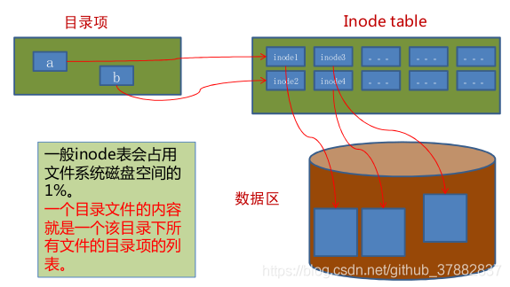
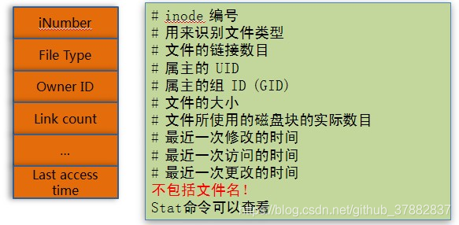

# ls -l [文件名] 命令


#### 第一字段：*文件属性字段*

```shell
drwxrwxr-x	4	rlk	rlk	4096 时间
```

第一个字符代表**文件的类型**。

| 字符 | 类型         |
| ---- | ------------ |
| -    | 普通文件     |
| d    | 目录文件     |
| l    | 链接文件     |
| c    | 字符设备文件 |
| p    | 命令管道文件 |
| s    | sock文件     |

第1字符的后面9个字母表示该文件或目录的权限位。

权限: 

| 标识 | 权限 |
| ---- | ---- |
| r    | 读   |
| w    | 写   |
| x    | 执行 |


#### 第二字段：*链接占用的节点*

该字段文件占用四个节点，属于软链接（符号链接）。

如果是一个目录，则第2字段表示该目录所含子目录的个数。


#### 第三字段：文件（目录）拥有者

#### 第四字段：文件（目录）拥有者所在的组

#### 第五字段:  文件夹所占用的空间(以字节为单位)

一般为4kb

#### 第六字段：文件（目录）最近访问（修改）时间

#### 第七字段：文件名


# 文件系统

1. 文件系统由字符路径转为inode节点号

2. 目录从路径中取得关键字检查出inode节点号

3. 由inode获取物理块号

4. 检查访问权限

   

文件存储结构大概如下：




目录项结构


inode结构



